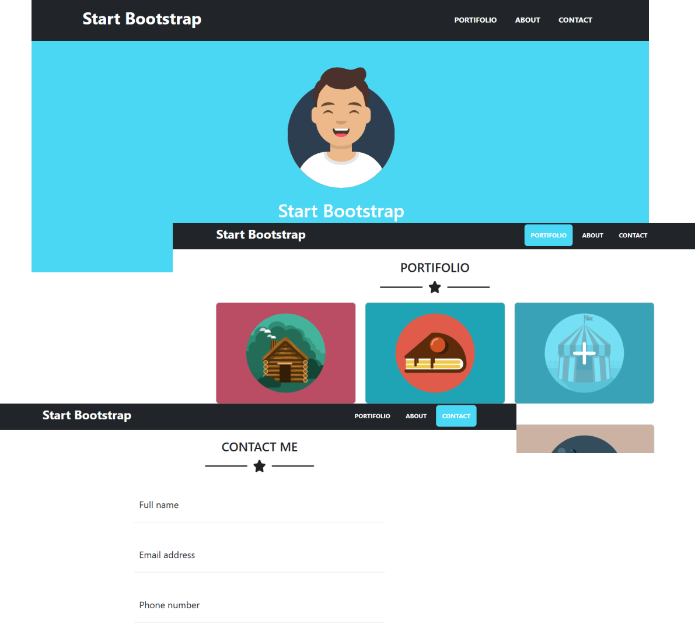

<h1 align="center"> Landingpage Bootstrap </h1>

Projeto de Landingpage - Curso Bootstrap Senai.

  <a href="#-tecnologias">Tecnologias</a>&nbsp;&nbsp;&nbsp;|&nbsp;&nbsp;&nbsp;
  <a href="#-projeto">Projeto</a>&nbsp;&nbsp;&nbsp;|&nbsp;&nbsp;&nbsp;
  <a href="#-layout">Layout</a>&nbsp;&nbsp;&nbsp;

 

  

## 🚀 Tecnologias

Esse projeto foi desenvolvido com as seguintes tecnologias:

- HTML e CSS
- Javascript
- Bootstrap
- Git e Github

## 💻 Projeto

O projeto é uma landingpage onde foram utilizados os atributos do Bootstrap, bem como um pouco de javascript.

## 🔖 Layout

Você pode visualizar o layout do projeto através [DESSE LINK](https://startbootstrap.com/previews/freelancer). O projeto foi apenas espelhado, o intuito não era que fosse identico ao original.